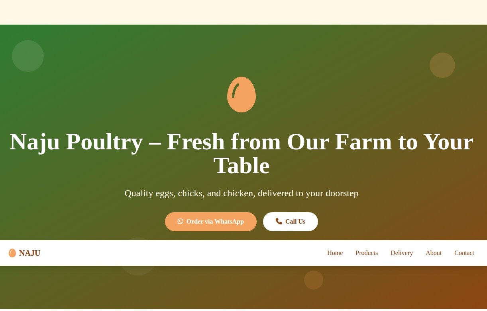

# Naju Poultry Website


A lightweight, fast-loading website for Naju Poultry built with HTML5, TailwindCSS, and Firebase.

## 🚀 Live Demo

Visit the live site: [https://naju-smoky.vercel.app](https://naju-smoky.vercel.app)

## 📸 Screenshots



## 🚀 Features

### Public Website
- **Home Page**: Hero section, featured products, 3-step process, company values
- **Products Page**: Dynamic product catalog with category filtering
- **Delivery Page**: Delivery areas, fee structure, and request form
- **About Page**: Company story, mission, values, and farm information
- **Contact Page**: Contact form, business hours, FAQ section

### Admin Panel
- **Dashboard**: Overview with statistics and recent activity
- **Product Management**: Add, edit, delete products with stock tracking
- **Delivery Requests**: Manage and track delivery orders
- **Contact Messages**: View and manage customer inquiries
- **Authentication**: Simple login system (admin/naju123)

## 🛠 Tech Stack

- **Frontend**: HTML5, TailwindCSS (CDN), Vanilla JavaScript
- **Database**: Firebase Firestore
- **Icons**: Font Awesome (CDN)
- **Design**: Mobile-first responsive design
- **Color Scheme**: 
  - Warm Brown (#8B4513) - Headers
  - Warm Orange (#F4A460) - Buttons
  - Fresh Green (#2E7D32) - Accents
  - Cream (#FFF8E7) - Background

## 📁 Project Structure

```
naju-poultry/
├── index.html          # Home page
├── products.html       # Products catalog
├── delivery.html       # Delivery information and form
├── about.html          # About us page
├── contact.html        # Contact page with form
├── admin.html          # Admin panel
└── README.md           # This file
```

## 🔧 Setup Instructions

### 1. Firebase Configuration
1. Create a new Firebase project at [https://console.firebase.google.com](https://console.firebase.google.com)
2. Enable Firestore Database
3. Get your Firebase configuration keys
4. Replace the placeholder config in all HTML files:

```javascript
const firebaseConfig = {
    apiKey: "YOUR_API_KEY",
    authDomain: "najupoultry.firebaseapp.com",
    projectId: "najupoultry",
    storageBucket: "najupoultry.appspot.com",
    messagingSenderId: "YOUR_SENDER_ID",
    appId: "YOUR_APP_ID"
};
```

### 2. Database Collections
The app will automatically create these collections in Firestore:

- **products**: Product catalog
- **deliveryRequests**: Customer delivery requests
- **contactMessages**: Contact form submissions

### 3. Update Contact Information
Replace placeholder contact details throughout the files:
- Phone numbers: `+254724442020`
- WhatsApp numbers
- Email: `najupoultry@gmail.com`
- Address details

## 🎨 Customization

### Colors
The color scheme is defined in the TailwindCSS config in each file:
```javascript
colors: {
    'naju-brown': '#8B4513',
    'naju-orange': '#F4A460',
    'naju-green': '#2E7D32',
    'naju-cream': '#FFF8E7'
}
```

### Admin Credentials
Default admin login:
- Username: `admin`
- Password: `naju123`

To change these, update the constants in `admin.html`:
```javascript
const ADMIN_USERNAME = 'admin';
const ADMIN_PASSWORD = 'naju123';
```

## 📱 Features Overview

### Product Management
- Add/edit/delete products
- Category filtering (Eggs, Chicks, Live Chicken, Dressed Chicken, Feed)
- Stock tracking with low-stock alerts
- Price management
- Product descriptions

### Delivery System
- Zone-based delivery fees
- Delivery request form with date/time selection
- Order status tracking (Pending, Contacted, Delivered, Cancelled)
- Delivery area coverage

### Contact Management
- Contact form submissions
- Message status tracking (New, Read)
- Customer inquiry management

### Responsive Design
- Mobile-first approach
- Tablet and desktop optimized
- Touch-friendly interface
- Fast loading with CDN resources

## 🚀 Deployment

### Static Hosting Options
1. **Firebase Hosting**: `firebase deploy`
2. **Netlify**: Drag and drop folder
3. **Vercel**: Connect GitHub repository
4. **GitHub Pages**: Enable pages in repository settings
5. **Any static hosting service**

### Before Deployment
1. Update Firebase configuration
2. Replace all placeholder contact information
3. Test all forms and functionality
4. Update admin credentials if needed

## 📊 Firebase Data Structure

### Products Collection
```javascript
{
  name: string,
  description: string,
  price: number,
  category: string (eggs, chicks, live, dressed, feed),
  unit: string (dozen, kg, bird, bag),
  stock: number,
  imageUrl: string,
  createdAt: timestamp
}
```

### Delivery Requests Collection
```javascript
{
  customerName: string,
  phone: string,
  address: string,
  preferredDate: string,
  preferredTime: string,
  productInterest: string,
  status: string (pending, contacted, delivered, cancelled),
  createdAt: timestamp
}
```

### Contact Messages Collection
```javascript
{
  name: string,
  email: string,
  phone: string,
  message: string,
  status: string (new, read),
  createdAt: timestamp
}
```

## 🔒 Security Notes

- Admin panel uses simple session-based authentication
- The default admin credentials (`admin` / `naju123`) are **development-only** — do not ship them to production. Replace them with a proper authentication solution before going live.
- Consider implementing proper Firebase Authentication for production
- Validate all user inputs on the backend
- Use HTTPS in production
- Consider rate limiting for forms

## 📈 Performance Optimizations

- Uses CDN for all external resources
- Minimal JavaScript dependencies
- Optimized images and assets
- Lazy loading for product images
- Efficient Firebase queries

## 🐛 Troubleshooting

### Common Issues
1. **Firebase not loading**: Check your Firebase configuration
2. **Forms not submitting**: Verify Firestore rules allow writes
3. **Admin login not working**: Check sessionStorage and credentials
4. **Products not showing**: Verify Firestore data structure

### Browser Compatibility
- Modern browsers (Chrome, Firefox, Safari, Edge)
- Mobile browsers (iOS Safari, Chrome Mobile)
- Internet Explorer is not supported

## 📞 Support

For issues or questions:
1. Check Firebase console for errors
2. Verify browser console for JavaScript errors
3. Ensure Firebase security rules allow read/write access
4. Test with different browsers if needed

## 🔄 Updates

The website is designed to be easily maintainable:
- Update content directly in HTML files
- Manage products through admin panel
- Firebase handles all data persistence
- No build process required

---

**Built with ❤️ for Naju Poultry**

## 📄 License

Proprietary. All rights reserved.

Copyright © 2026 Naju Poultry. This repository and its contents are the exclusive property of Naju Poultry. You may not copy, modify, distribute, sublicense, or use any part of this code without prior written permission.
